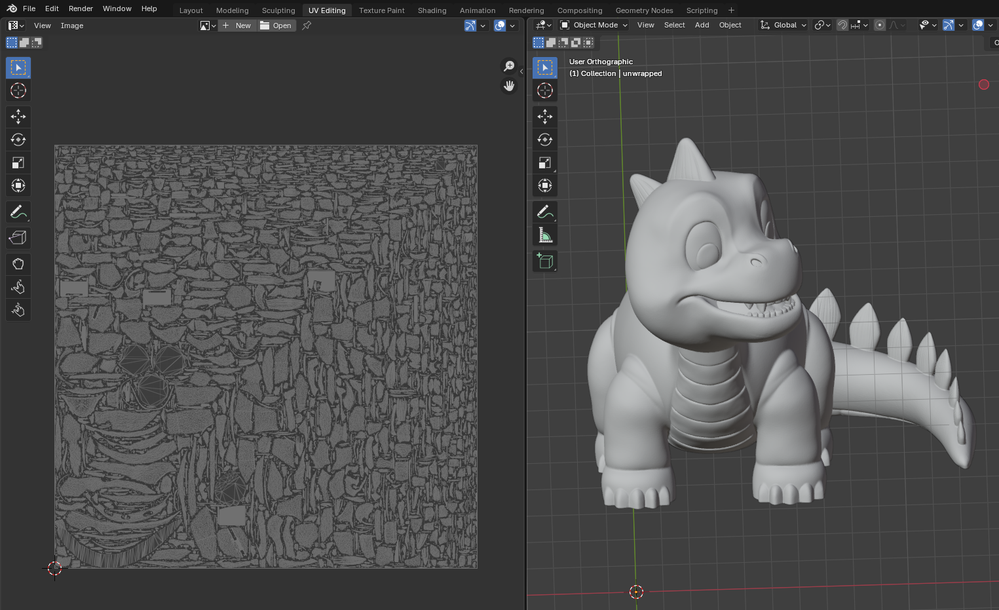

# Uvula

This library is a standalone UV-unwrapper for potentially big meshes, that provides grouped and non-overlapping patches of projected faces on a texture. They can be used e.g. for painting on a mesh.



## Build

This project uses conan2 as dependency manager, so building it should be straightforward if you have it installed properly:

```bash
conan install . --build=missing
source build/Release/generators/conanbuild.sh
cmake --preset conan-release
cmake --build --preset conan-release
```

## Python binding

The python bindings are built by default, but can be ignored by adding `-o with_python_bindings=False` when doing the setup with `conan`.

Once built, just make sure you have the library in the path and call the `unwrap` function:

```python
import pyUvula as uvula
vertices = numpy.ndarray((100, 3))
indices = numpy.ndarray((100, 3))
...
uvs, texture_width, texture_height = uvula.unwrap(vertices, indices)
```

The returned width and height are the recommended values for the texture. It is usually almost square, and one of the sides is 4096. The used texture size can be different because the UV coordinates are given in [0,1] range but the width/ratio should be kept.

## Command-line tool

A command-line tool is provided for the convenience of testing, and can be built by adding `-o with_cli=True` when doing the setup with `conan`. Then the use is pretty simple:

```bash
./build/Release/cli/uvula /home/myself/dinosaur.stl -o /home/myself/dinosaur_unwrapped.obj
```

Then you can display the resulting OBJ file with e.g. Blender.

For more options, just look at the help:
```bash
./build/Release/cli/uvula --help
Test interface for the libuvula library
Usage:
  Uvula [OPTION...] <filepath>

      --filepath arg    Path of the 3D mesh file to be loaded (OBJ, STL, ...)
  -o, --outputfile arg  Path of the output 3D mesh with UV coordinates (OBJ)
  -d, --debug           Display debug output
  -h, --help            Print this help and exit
```

## Technical insights

The algorithm works in 3 steps:
* First one is grouping the faces of the mesh by normal proximity, so that we can make patches of faces that can be project without too much shrinking. The implementation of this step is inspired from the "Smart UV Project" from Blender.
* The second step is to split the groups by spatial proximity. By doing so, you ensure that only consistent patches will be kept together, and not faces that have the same normal but not linked to each other.
* Finally, all the patches should be placed on a texture to maximize the surface filling. For this we use the very effective packing method from [xatlas](https://github.com/jpcy/xatlas/)

## Performances

The unwrapping method was designed with performance in mind. For the benchmark, we used a dinosaur model which has 585,247 faces. The original version used the whole xatlas method, and was about 5 minutes long. So we replaced the faces grouping by a more simple version. Now the full unwrapping is ~3s for the same model.
